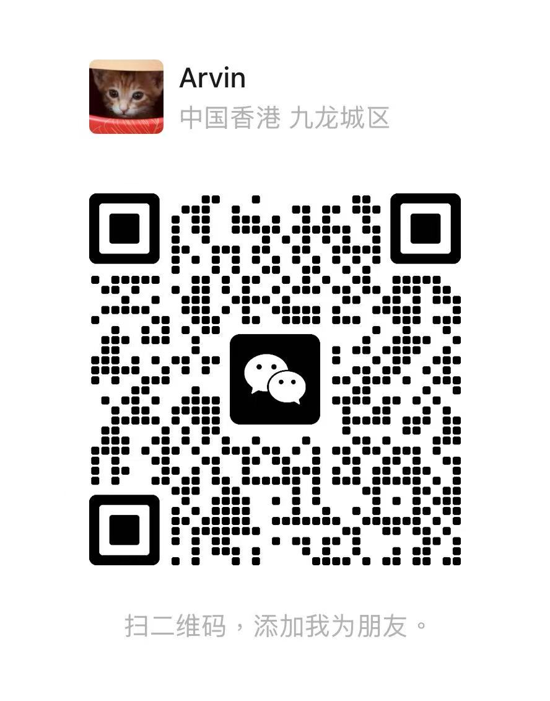

# DrumCat 产品文案

## 可直接发布版

### DrumCat：一只会陪你打字、专注、聊天的写实桌面宠物

它不只是一张会动的贴图，而是一只真正生活在桌面上的本地陪伴宠物。

DrumCat 采用半写实 3D 毛发皮肤，能够自动眨眼、待机、睡觉，也会看向你的鼠标。你打字时，它会跟着敲鼓或挥爪；你点击它时，它会跳起来回应；完成一轮专注后，它还会用动作和表情替你庆祝。

第一版已经内置蓝灰英国短毛猫“奶盖”和赤色柴犬“栗子”。两套皮肤都适配完整动作、睡眠状态、自动眨眼与 16 向目光跟随，不是简单换一张静态图片。

你可以直接和它说：

- “专注 25 分钟”
- “20 分钟后提醒我喝水”
- “会议模式”
- “换成柴犬皮肤”
- “睡觉”或“醒醒”
- “定制皮肤”

不开启任何 AI 接口时，桌宠、键鼠互动、本地对话、番茄钟、任务、提醒、场景模式和所有窗口功能都可以正常使用。需要更自由的对话时，也可以自行接入 OpenAI 兼容接口；密钥只保留在本次运行的内存中，退出软件后自动清空。

DrumCat 还提供陪伴、专注、安静、会议、游戏和直播六种场景模式。开会时可以完全静音，直播时会自动隐藏私人备忘，专注时会减少主动打扰。它可以始终置顶，也可以开启鼠标穿透、调节透明度、吸附屏幕边缘，或者通过托盘与全局快捷键随时叫出。

如果你希望把自己家的猫、狗，甚至原创角色做成桌宠，衣橱里已经加入“定制你的专属皮肤”入口。扫码添加 Arvin，发送参考照片、品种花色和动作需求，即可沟通专属皮肤。

一句话概括：

> DrumCat 是一只会看你、回应你、陪你完成事情，也懂得安静待着的本地桌面宠物。

## 核心卖点

### 1. 半写实宠物，不再是像素小人

- 英国短毛猫“奶盖”：蓝灰短绒、铜金眼睛，沉稳黏人。
- 赤色柴犬“栗子”：立耳卷尾，精神温暖。
- 真实毛发质感与清晰品种特征。
- 每套皮肤适配完整动作、睡眠、眨眼和 16 向目光。
- 支持联系 Arvin 定制自己的宠物或原创角色。

### 2. 你的输入会变成它的动作

- 键盘输入时自动敲鼓或挥爪。
- 鼠标移动时，宠物会转头看向光标。
- 左键、右键和中键可以绑定不同动作。
- 点击、拖动、长时间待机、专注完成和提醒到点均可触发动作。
- 回复内容会驱动开心、兴奋、思考、困倦等表情和动作。

### 3. 不接 API，也是一套完整产品

- 本地规则聊天与自然语言指令。
- 本地番茄钟、任务和定时提醒。
- 本地窗口、皮肤、动作和模式设置。
- 本地保存最近对话、个人称呼、当前目标和偏好备忘。
- 远程 AI 关闭或接口失败时自动回退到本地回复。

### 4. 真正适合工作场景

- 专注计时、暂停、继续、结束和自动休息。
- 当前任务、完成状态和专注轮次统计。
- 定时提醒与原生系统通知。
- 长时间无操作时适度提醒喝水或休息。
- 每日主动消息上限，避免过度打扰。
- 会议、直播和游戏时使用专门的低打扰模式。

### 5. 桌面窗口足够灵活

- 透明、无边框、可缩放的桌面窗口。
- 始终置顶或恢复普通窗口层级。
- 自由拖动，靠近屏幕边缘自动吸附。
- 保持在屏幕范围内，适配多显示器切换。
- 调节宠物尺寸、透明度与动作速度。
- 鼠标穿透、靠近隐藏、镜像角色和减少动态效果。
- 可隐藏 Dock / 任务栏图标，通过托盘继续控制。

### 6. 隐私默认优先

- 聊天、任务、提醒和偏好默认只保存在本机。
- 不记录具体键盘输入内容，键盘事件只用于触发动作。
- API 密钥不写入磁盘。
- 语音、图片理解和远程 AI 默认关闭。
- 图片只有在用户手动添加并开启图片理解后才会交给远程接口。
- 直播模式不会把私人备忘加入模型上下文。

## 当前版本完整功能清单

以下内容与 DrumCat v0.1.0 当前实现保持一致。

### 桌面与窗口

- 透明背景主窗口。
- 无边框桌面显示。
- 始终置顶开关。
- 普通窗口层级切换。
- 主窗口自由拖动。
- 窗口原生缩放。
- 设置中提供 25%–250% 尺寸调节。
- Shift + 鼠标右键拖动快速缩放。
- 20%–100% 透明度调节。
- 显示或隐藏桌宠。
- 鼠标穿透开关。
- 鼠标靠近自动隐藏及延迟设置。
- 屏幕边缘吸附及吸附距离设置。
- 保持窗口位于当前屏幕内。
- 宠物水平镜像。
- 鼠标方向反向跟随。
- Dock / 任务栏图标显示开关。
- 托盘图标显示开关。
- 开机自动启动。
- 多显示器位置修正。

### 皮肤与动画

- 蓝灰英国短毛猫“奶盖”半写实 3D 皮肤。
- 赤色柴犬“栗子”半写实 3D 皮肤。
- 定制专属皮肤入口与微信二维码。
- 皮肤分类筛选：全部、猫猫、狗狗。
- 衣橱和设置页均可切换皮肤。
- 托盘菜单可快速切换皮肤。
- 自动眨眼。
- 待机动作。
- 自动睡眠。
- 手动立即睡觉。
- 点击或指令唤醒。
- 敲鼓 / 挥爪。
- 挥手打招呼。
- 跳起庆祝。
- 认真思考。
- 失落趴下。
- 安静待机。
- 16 方向鼠标目光跟随。
- 动画速度调节。
- 最大事件采样率调节。
- 减少动态效果模式。

### 键盘与鼠标互动

- 全局键盘输入触发动作。
- 全局鼠标移动触发目光跟随。
- 全局鼠标点击触发动作。
- 左键、右键和中键独立动作绑定。
- 桌宠本体左键点击互动。
- 桌宠本体右键动作与快捷菜单。
- 拖动桌宠窗口。
- Shift + 右键拖动调整尺寸。
- 自动互动总开关。
- 键盘互动独立隐私开关。
- 鼠标互动独立隐私开关。
- 长时间待机动作。
- 所有动作绑定均可在设置中即时预览。

### 本地对话与指令

- 无 API 时可使用本地规则对话。
- 睡觉与唤醒指令。
- 自定义分钟数的专注指令。
- “几分钟 / 几小时后提醒我……”自然语言提醒。
- 陪伴、专注、安静、会议、游戏和直播模式指令。
- 猫狗皮肤切换指令。
- “定制皮肤”指令打开定制入口。
- 本地回复根据内容自动选择动作和表情。
- AI 接口不可用时自动回退到本地模式并说明原因。
- 最近对话最多保存 20 条。
- 清空对话记录。
- 关闭对话记忆后立即删除本地记忆副本。
- 用户称呼、当前目标和偏好备忘。
- 四种性格：温暖搭子、轻傲娇、专注教练、安静陪伴。

### 可选 AI、语音与图片

- OpenAI 兼容接口地址设置。
- 自定义模型名称。
- 本次会话 API 密钥。
- 流式回复开关。
- 远程回复驱动宠物动作与表情。
- 手动添加图片附件。
- 图片理解独立授权开关。
- 图片关闭时不会读取或上传附件内容。
- 系统 TTS 语音朗读。
- 语音输入功能检测与明确的不支持提示。
- 会议模式自动禁止语音朗读。
- API 密钥退出后自动清空且不落盘。

### 专注、任务与提醒

- 1–180 分钟专注计时。
- 1–60 分钟自动休息。
- 开始、暂停、继续和结束。
- 专注与休息进度显示。
- 完成专注轮次统计。
- 到点后自动进入休息。
- 当前任务列表。
- 任务完成与删除。
- 最多保存 20 条任务。
- 自然语言创建定时提醒。
- 待触发提醒列表。
- 提醒删除。
- 到点气泡、动作和表情。
- 原生系统通知。
- 重启后继续处理未结束或已到期的计时状态。
- 长时间无操作主动关心。
- 每日主动消息数量上限。

### 场景模式

- 陪伴模式：完整互动与主动关心。
- 专注模式：保留输入动作，减少主动消息。
- 安静模式：暂停键鼠动作与主动消息。
- 会议模式：完全静音，只保留手动操作。
- 游戏模式：保留点击互动，不发送主动消息。
- 直播 / OBS 模式：隐藏私人记忆，适合画面捕捉。

### 托盘、菜单与快捷键

- 系统托盘菜单。
- 显示 / 隐藏桌宠。
- 打开设置。
- 开始或结束 25 分钟专注。
- 切换场景模式。
- 切换皮肤。
- 切换窗口穿透。
- 切换始终置顶。
- 立即睡觉或唤醒。
- 快速设置尺寸和透明度。
- 重启和退出应用。
- 六组可自定义全局快捷键：
  - 显示 / 隐藏桌宠。
  - 打开设置。
  - 打开陪伴面板。
  - 镜像角色。
  - 鼠标穿透。
  - 切换置顶。
- 主窗口内 `Cmd/Ctrl + K` 快速打开对话面板。

### 设置、诊断与持久化

- 全中文设置界面。
- 外观、陪伴、互动、专注、系统和关于六个设置分类。
- 设置自动保存到本机。
- 输入监控权限状态检查。
- macOS 输入监控授权入口。
- Windows 管理员权限提示。
- 系统、架构、Tauri 与应用版本诊断信息复制。
- 应用日志目录一键打开。
- 本地隐私说明。

## 平台与当前边界

- 当前已经生成并实测 macOS Apple Silicon 应用与 DMG。
- 源码采用 Tauri、Vue 3 和 Rust，已提供由 GitHub Actions Windows x64 构建机生成的 NSIS 安装包。
- 跨应用键鼠互动需要操作系统授予输入监控权限。
- 自由 AI 对话和图片理解需要用户自行配置兼容 API。
- 语音输入取决于系统 WebView 是否提供语音识别，本版不打包大型离线模型。
- 当前 macOS 包使用 ad-hoc 签名，尚未进行 Apple 公证。

## 定制皮肤联系文案

想把自己家的猫猫、狗狗，或者原创角色做成桌宠？

扫码添加 Arvin，发送：

1. 3–6 张清晰参考照片。
2. 品种、花色、名字与性格特点。
3. 想保留的标志性动作或道具。

即可沟通一套适配 DrumCat 眨眼、待机、互动、睡眠、回复动作和 16 向目光跟随的专属皮肤。

